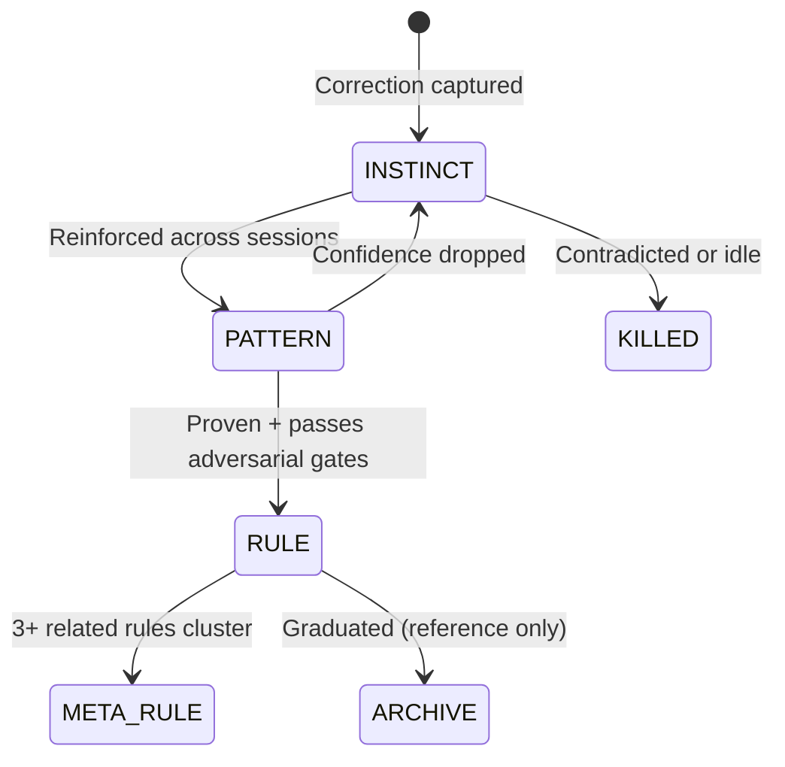
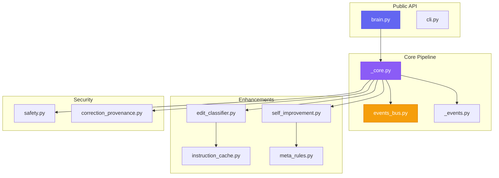

# Gradata

### Your AI keeps making the same mistakes. Gradata makes it stop.

[](https://github.com/Gradata/gradata/actions/workflows/test.yml)
[](https://pypi.org/project/gradata/)
[](https://pypi.org/project/gradata/)
[](LICENSE)

You fix a tone. You rewrite a regex. You re-explain how your team formats PRs. Then the AI forgets, and you do it all again next session.

**Gradata turns every correction into a rule your AI carries forward.** Not a longer prompt. Not a bigger context window. A behavioral rule that graduates from instinct → pattern → rule the more it proves itself — and dies the moment it stops.

```bash
pip install gradata
```

One-command setup for your agent:

```bash
gradata install --agent claude-code --brain ./my-brain
```

Works with any LLM. Python 3.11+. Zero required dependencies. Local-first. Apache-2.0.

---

## The 30-second pitch

Memory systems remember what you said. **Gradata learns how you think.**

| System | Remembers | Learns from corrections | Graduates rules | Proves convergence |
|--------|:---------:|:-----------------------:|:---------------:|:------------------:|
| Mem0 | ✓ | — | — | — |
| Letta (MemGPT) | ✓ | — | — | — |
| LangChain Memory | ✓ | — | — | — |
| **Gradata** | ✓ | **✓** | **✓** | **✓** |

- **vs fine-tuning** — no training run, no model lock-in, no GPU. Adapts at inference time.
- **vs system prompts** — static rules you hand-write vs dynamic rules the model earns.
- **vs Mem0 / Letta** — they store context; Gradata evolves behavior. Use both.

Not generally smarter. Calibrated to you.

---

## How it works


Every correction creates a lesson. Lessons compete. Contradicted rules lose confidence and die. Idle rules decay. Only rules that survive real-world application get promoted into your AI's behavior.

**This is evolution, not configuration.**



---

## Show me it works

**Ablation v4** — 4 models × 6 conditions × 16 tasks × 3 iterations = 432 trials, blind-judged by Haiku 4.5.

| Model | Preference lift (rules vs base) | Correctness lift |
|-------|:-------------------------------:|:----------------:|
| Sonnet 4.6 | **+2.7%** | +0.4% |
| DeepSeek V3 | **+5.1%** | +0.9% |
| qwen2.5-coder 14B | **+5.7%** | +3.6% |
| gemma3:4b | **+3.4%** | +1.1% |

**The rules aren't just a format trick.** We ran the Min et al. (2022) random-label control — plausible-but-unrelated rule text in the same envelope. Three of four models regress by 3–10%. **Content is doing the work, not XML structure.**

Smaller/local models benefit most. Frontier models get calibrated faster. The curve is the product demo: *corrections-per-session drops monotonically as the brain converges.*

---

## Quickstart

Install Gradata, create a brain, then attach it to the agent you use every day:

```bash
pip install gradata
gradata init ./my-brain
gradata install --agent claude-code --brain ./my-brain
gradata audit
```

Supported agent targets:

```bash
gradata install --agent claude-code
gradata install --agent codex
gradata install --agent gemini
gradata install --agent cursor
gradata install --agent hermes
gradata install --agent opencode
gradata install --agent all
```

Once installed, Gradata recalls relevant behavioral rules before tool use. You can also call recall directly:

```bash
gradata recall "drafting cold email to PE-backed ecommerce CMO" --max-tokens 2000
```

## Bring your own API key

Gradata defaults to `CLIProvider`, which reuses your installed Claude Code, Codex, or Gemini CLI. If you want clearer API terms, do not want to install a CLI, or want lower call latency, configure Gradata to call your own Anthropic, OpenAI, or Google key directly.

```bash
pip install "gradata[llm]"
gradata config set-llm api --vendor anthropic --key sk-ant-...
gradata config set-llm cli
```

You can omit `--key` when `ANTHROPIC_API_KEY`, `OPENAI_API_KEY`, or `GOOGLE_API_KEY` is already set. Typical Gradata LLM synthesis usage is about $0.01-0.05 per session, depending on model and how many corrections need synthesis.

## Auto-Improvement (`gradata tune`)

Use Microsoft's APO algorithm to auto-tune any prompt template against
your Gradata corrections.

```bash
pip install "gradata[tune-apo]"
gradata tune ./my-prompt.md --rounds 2 --brain ./my-brain
```

The optimizer reads your `Brain`'s correction history, treats every
matching correction as a reward signal, and produces an optimized prompt
that scores higher on held-out corrections.

No GPU required — runs on subscription CLIs via litellm proxy.

## 60-second demo

```python
from gradata import Brain

brain = Brain.init("./my-brain")

# Your AI produces output. You fix it. The brain learns.
brain.correct(
    draft="We are pleased to inform you of our new product offering.",
    final="Hey, check out what we just shipped.",
)
# → Extracts: "Write in a casual, direct tone, avoid formal business language"

# Next session, learned rules are injected automatically:
rules = brain.apply_brain_rules("write an email")
# → [RULE] TONE: Write in a casual, direct tone...

# Prove the brain is converging:
brain.manifest()   # Mathematical proof of convergence
brain.prove()      # Paired t-test on correction rate
```

---

## Install (pick one)

### Claude Code (recommended)

```
/plugin marketplace add Gradata/gradata
/plugin install gradata
```

Prereq: `pipx install gradata`. See [`.claude-plugin/README.md`](./.claude-plugin/README.md).

### Python SDK

```bash
pipx install gradata
gradata init ./my-brain
gradata install --agent claude-code --brain ./my-brain
```

### JS / TypeScript

The `@gradata/cli` npm package talks to a local Gradata daemon — no Python required at call time:

```bash
npm i @gradata/cli
```

```ts
import { GradataClient } from "@gradata/cli";

const client = new GradataClient({ endpoint: "http://127.0.0.1:8765" });
await client.correct({
  draft: "We are pleased to inform you of our new product offering.",
  final: "Hey, check out what we just shipped.",
  outputType: "email",
});
```

Full API in [`packages/npm/README.md`](./packages/npm/README.md).

### Docker

```bash
docker run --rm -p 8765:8765 -v $(pwd)/brain:/brain \
  ghcr.io/gradata/gradata/daemon:latest \
  daemon --brain-dir /brain --port 8765
```

Or `docker build -t gradata/daemon:dev .` from the repo root. `docker-compose.yml` included for local dev.

### CLI

```bash
gradata init ./my-brain        # create a brain
gradata install --agent codex  # install recall hook for an agent
gradata demo ./eval-brain      # try a pre-trained one
gradata convergence            # ASCII chart of correction trend
gradata manifest --json        # mathematical convergence proof
gradata review                 # approve/reject pending promotions
gradata stats                  # brain health metrics
gradata doctor                 # diagnose issues
```

### Advanced: manual hook setup

`gradata install --agent <name>` writes the native config for each supported agent and preserves existing settings. If you need to wire a hook manually, point the agent's pre-tool hook at:

```bash
python -m gradata.hooks.inject_brain_rules --brain-dir ./my-brain
```

For MCP-only clients, register:

```bash
python -m gradata.mcp_server --brain-dir ./my-brain
```

---

## What's in the box

**Core learning loop**
- `brain.correct(draft, final)` — captures corrections, extracts behavioral instructions
- `brain.apply_brain_rules(task)` — injects graduated rules into prompts
- `brain.manifest()` / `brain.prove()` — convergence proof, not vanity metrics
- Event bus: `brain.bus.on("correction.created" | "lesson.graduated" | "meta_rule.created" | "session.ended", handler)`

**Meta-rules.** When 3+ rules cluster, an LLM synthesizes a scoped meta-rule with `applies_when` / `never_when` conditions.

**Security.** PII redaction before storage • HMAC-SHA256 provenance on every correction • score obfuscation so confidence never leaks to the LLM • per-brain salt on graduation thresholds.

**Integrations.** OpenAI · Anthropic · LangChain · CrewAI adapters · MCP server for Claude Code / Cursor / Windsurf · Claude Code hooks that auto-capture corrections · custom providers via `GRADATA_LLM_PROVIDER=openai` (or any OpenAI-compatible endpoint).

---

## Inspection & Transparency

Every graduated rule can be traced back to the corrections that created it. No opaque behavior. **Git diff for AI preferences.**

```python
from gradata import Brain

brain = Brain("./my-brain")

# List graduated rules (optionally filter)
brain.rules()
brain.rules(include_all=True, category="tone")

# Trace a rule to the corrections that created it
brain.explain("rule_abc123")
# → {"rule_id": ..., "description": ..., "source_corrections": [...], "sessions": [...]}

# Full provenance chain (rule → lesson → corrections → events)
brain.trace("rule_abc123")

# Export for review, diffing, or sharing
brain.export_data(output_format="json")           # or "yaml"
brain.export_rules(min_state="PATTERN")           # OpenSpace-compatible SKILL.md
brain.export_rules_json(min_state="RULE")         # flat sorted array
brain.export_skill(output_dir="./skills")         # full skill directory
brain.export_tree(format="obsidian", path="./vault")

# Human veto
brain.pending_promotions()
brain.approve_promotion("rule_abc123")
brain.reject_promotion("rule_abc123")
```

Full signatures in [`docs/sdk/brain.md`](./docs/sdk/brain.md#inspection--transparency).

---

## Architecture



---

## Repo layout

- `src/gradata/` — the Python SDK (correction → rules → graduation pipeline)
- `tests/` — SDK tests (pytest)
- `docs/` — mkdocs site sources (published to gradata.ai/docs)
- `examples/` — SDK usage examples
- `packages/npm/` — `@gradata/cli` JS client
- `gradata-install/` — npm wrapper for one-command IDE setup
- `.claude-plugin/` + `hooks/` — Claude Code plugin manifest
- `brain/` — research scripts (benchmarks, simulations)

---

## Community

- **[GitHub Issues](https://github.com/Gradata/gradata/issues)** — bugs, features, questions
- **[GitHub Discussions](https://github.com/Gradata/gradata/discussions)** — ideas, show & tell
- **[Docs](https://gradata.github.io/gradata/)** — guides, API reference

## Intellectual lineage

Built on Constitutional AI (Anthropic, 2022), Duolingo's half-life regression (Settles & Meeder, ACL 2016), the Copilot RCT (Peng et al., 2023), SuperMemo's two-component memory model (Wozniak, 1995), and MT-Bench LLM-as-judge (Zheng et al., NeurIPS 2023). Sits alongside Mem0, Letta, and EverMind — with one difference: **Gradata learns from your corrections, not just recalls facts.** Full credits in [CREDITS.md](./CREDITS.md).

## Contributing

See [CONTRIBUTING.md](CONTRIBUTING.md).

## License

**Apache-2.0.** The full SDK — rules, hooks, graduation, meta-synthesis, scoring, profiling — is permissively open. Use it anywhere: commercial, proprietary, SaaS, internal tooling. No copyleft, no linking obligations, no commercial-license upsell.

**[Gradata Cloud](https://gradata.ai)** is an optional hosted service (team brain, corrections corpus, brain marketplace, managed LLM). The SDK does not require it — everything works locally with your own LLM key.
