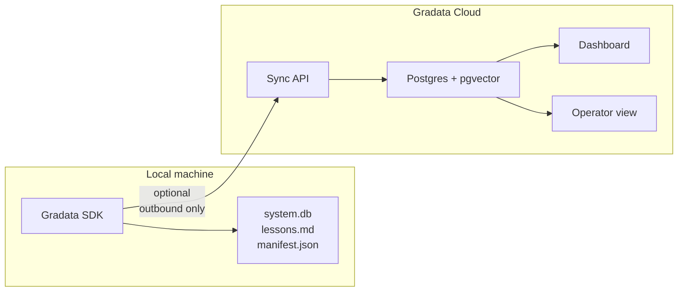

# Gradata Cloud

Gradata Cloud is the hosted dashboard that complements the open-source SDK. **The SDK is functionally complete on its own** — graduation, meta-rule synthesis, rule-to-hook promotion, and every piece of the learning loop run locally. Cloud adds visualization, cross-device continuity, team sharing, and managed backups on top of that local loop.

## What's in the SDK vs the Cloud

| Capability | Open-source SDK | Gradata Cloud |
|------------|----------------|---------------|
| `Brain` class and local storage | Yes | Yes |
| Correction capture and graduation | Yes | Yes |
| Hooks and MCP server | Yes | Yes |
| Rule-to-hook promotion | Yes | Yes |
| `brain.manifest.json` generation | Yes | Yes |
| Search (FTS5 + optional embeddings) | Yes | Yes |
| Cross-platform export (`.cursorrules`, `BRAIN-RULES.md`, ...) | Yes | Yes |
| Meta-rule **clustering** | Yes | Yes |
| Meta-rule **synthesis** (local LLM via your own key or Claude Code Max OAuth) | Yes | Yes |
| Dashboard with charts | No | Yes |
| Cross-device sync of a brain | No | Yes |
| Team brains (shared rules, per-member overrides) | No | Yes |
| Operator view (customer KPIs, alerts) | No | Yes |
| Managed backups | No | Yes |

The SDK is Apache-2.0 and will stay permissively open. Cloud is a hosted SaaS tier that **visualizes** the local learning loop — it does not gate, override, or re-run it. Team features and brain marketplace build on top later.

## When to self-host vs use Cloud

**Stay self-hosted if:**

- Your brain is a single user's procedural memory and you already have compute.
- You need data residency guarantees outside of Gradata's hosted regions.
- You're exploring the SDK and don't need dashboards yet.

**Use Cloud if:**

- You want a dashboard to watch your brain mature (graduations, correction-rate decay, compound-quality score).
- Teams can maintain shared, version-controlled brains across multiple operators.
- Managed backups and cross-device sync handled for you.
- Operator / alerting view for engineering leads.

## Architecture



The SDK talks to Cloud only when you opt in with an API key. Sync is strictly outbound and read-only from Cloud's perspective: your local brain is the source of truth, Cloud holds a mirror plus derived metrics. Cloud never mutates your local state or re-runs graduation.

## Getting an API key

1. Sign up at [gradata.ai](https://gradata.ai).
2. In the dashboard, go to **Settings → API keys**.
3. Create a key scoped to the brains you want to sync.

Then:

```bash
export GRADATA_API_KEY=your-key
```

See [API Reference](api.md) for full endpoint documentation.

## Sync

```python
from gradata.cloud import CloudClient

client = CloudClient("./my-brain", api_key="your-key")
client.connect()
client.sync()
```

Sync is incremental: only events since the last cursor are sent. Large brains with hundreds of sessions sync in seconds.

## Privacy

- Sync is opt-in. No data leaves your machine without an explicit sync call or a configured API key.
- Raw corrections can be redacted before sync via the brain's PII taxonomy.
- Brain packages shared with other users (via `brain.share()`) contain graduated rules only — never raw events.

See [FAQ](../faq.md) for data ownership and deletion policy.

## Next

- [Dashboard](dashboard.md) — widgets, operator view, team management
- [API Reference](api.md) — REST endpoints for workspaces, brains, corrections
