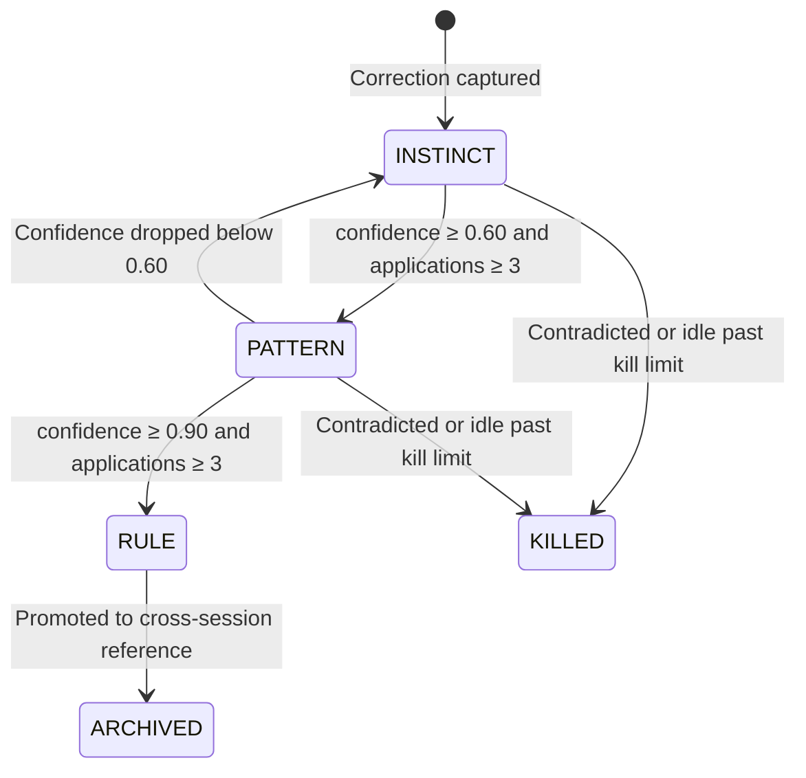

# Graduation

Graduation is how a correction becomes a rule your AI actually enforces. Lessons move through three tiers — INSTINCT, PATTERN, RULE — by surviving repeated real-world application.

## The three tiers

| State | Meaning | Confidence range | Applies to prompts? |
|-------|---------|------------------|---------------------|
| `INSTINCT` | Tentative. New correction, not yet proven. | ≈ 0.30 – 0.59 | No |
| `PATTERN` | Proven. At least 3 applications, confidence in the 0.60–0.89 band. | 0.60 – 0.89 | Yes, as `SHOULD` |
| `RULE` | Battle-tested. 3+ applications at ≥ 0.90 confidence. | ≥ 0.90 | Yes, as `MUST` |

Archived lessons are RULEs that have been promoted to cross-session reference and are no longer actively re-evaluated.



## Confidence math

Every lesson starts at `INITIAL_CONFIDENCE = 0.60`. Each session, confidence is updated based on what happened to the lesson:

| Event | Adjustment |
|-------|------------|
| **Acceptance** — rule fired and output was accepted | `+ACCEPTANCE_BONUS (0.20)` |
| **Survival** — rule was relevant but not fired, and the output held up | `+SURVIVAL_BONUS (0.08)` |
| **Misfire** — rule fired but was irrelevant | `MISFIRE_PENALTY (−0.15)` |
| **Contradiction** — rule fired but was immediately reversed | `CONTRADICTION_PENALTY (−0.17)` × severity |

Raw adjustments are passed through **FSRS-inspired damping**: bonuses shrink as confidence rises (diminishing returns) and penalties grow with confidence (more to lose when you're wrong). This prevents runaway confidence and keeps the 0.80 RULE threshold meaningful.

```python
# From gradata.enhancements.self_improvement
def fsrs_bonus(confidence: float, *, machine: bool = False) -> float:
    base = MACHINE_ACCEPTANCE_BONUS if machine else ACCEPTANCE_BONUS
    damping = 0.8 if machine else 1.0
    return round(base * (1.0 - confidence * damping), 4)
```

## Severity weighting

Contradictions are multiplied by a severity factor so typo-level pushback doesn't kill a rule:

| Severity | Penalty multiplier | Example |
|----------|-------------------|---------|
| `trivial` | 0.20 | Typo fix |
| `minor` | 0.50 | Single word swap |
| `moderate` | 0.80 | Sentence rewrite |
| `major` | 1.00 | Multi-sentence change |
| `rewrite` | 1.30 | Output discarded |

And contradictions that specifically **reverse** a rule get an extra `CONTRADICTION_ACCELERATION = 1.5x` boost, plus a streak multiplier if they happen consecutively (`1st=1.0x, 2nd=1.5x, 3rd=2.0x...`). This is what makes preference reversal fast — 5 consistent contradictions usually kill a rule instead of 10.

## Kill limits

Idle and contradicted lessons die. Kill limits are maturity-aware:

| Maturity | Sessions trained | Kill limit |
|----------|------------------|-----------|
| `INFANT` | 0 – 50 | 8 |
| `ADOLESCENT` | 50 – 100 | 12 |
| `MATURE` | 100 – 200 | 15 |
| `STABLE` | 200+ | 20 |

If a lesson stays under 0.30 confidence for more sessions than the kill limit for its maturity tier, it's deleted.

## Minimum applications

Confidence is not enough. A lesson must also be *applied* (or meaningfully tested) to graduate:

- **PATTERN:** `MIN_APPLICATIONS_FOR_PATTERN = 3`
- **RULE:** `MIN_APPLICATIONS_FOR_RULE = 3`

This prevents a single moment of certainty from pushing an untested rule to RULE tier.

## Graduation gates

Even if confidence and applications both pass, the graduation pipeline runs adversarial gates before promoting:

1. **Dedup gate** — near-duplicate detection with a 0.85 similarity threshold. If the new rule is essentially a paraphrase of an existing rule, it's merged instead of promoted.
2. **Poisoning gate** — if > 40% of corrections in a category contradict each other, confidence updates are muted. Protects against intentional or accidental corruption of the correction stream.
3. **Session-type gate** — certain categories are immune in certain session types. `DRAFTING` corrections in a `systems` session won't update tone rules, and `ARCHITECTURE` corrections in a `sales` session won't update engineering rules.

## Machine-context mode

Bulk simulations and autoresearch runs produce 60+ corrections per session with zero human approval signal. Gradata detects this (heuristic: > 25 corrections with no explicit approvals) and switches to softer math:

| Parameter | Human | Machine |
|-----------|-------|---------|
| Contradiction penalty | −0.17 | −0.06 |
| Acceptance bonus | 0.20 | 0.16 |
| Kill limit (INFANT) | 8 | 16 |
| Severity weight (moderate) | 0.80 | 0.50 |

Machine mode makes confidence harder to move in both directions, so stress-test noise doesn't inflate or flatten the real signal.

## Running graduation

End of session:

```python
result = brain.end_session()
# {
#   "session": 42,
#   "total_lessons": 15,
#   "promotions": 2,       # lessons that moved up a tier
#   "demotions": 0,
#   "new_rules": 1,
#   "meta_rules_discovered": 0,
# }
```

Or via CLI:

```bash
# Triggered automatically by the session_close hook at Stop time.
# To run manually in a script:
python -c "from gradata import Brain; print(Brain('./my-brain').end_session())"
```

## Inspecting graduation history

```python
# Provenance chain: correction → lesson → rule
brain.lineage(category="TONE", limit=20)
```

```bash
gradata report --type rules     # what's active
gradata convergence             # corrections-per-session trend
```

Next: [Meta-Rules](meta-rules.md) — how 3+ related RULEs cluster into higher-order principles.
