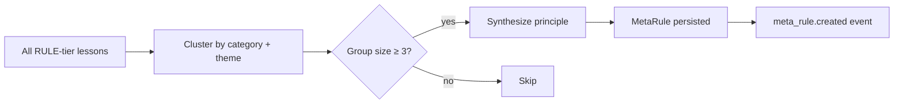

# Meta-Rules

A **meta-rule** is a higher-order behavioral principle that emerges when 3 or more related RULE-tier lessons cluster around the same theme. Meta-rules are how the brain generalizes from specific cases to portable principles.

## Why they exist

Individual rules are narrow. Consider three graduated rules:

```text
[RULE:0.92] PROCESS: Never jump to implementation. Always plan → adversary → fix → THEN build.
[RULE:0.88] PROCESS: Always audit existing code before proposing new files.
[RULE:0.85] PROCESS: When the user asks "what's next", refresh Gmail and calendar first.
```

Each rule is useful in its own scope. But they share a principle: *don't act on stale assumptions*. The brain clusters them into a single meta-rule:

```text
META-RULE [process_discipline] (confidence: 0.88, sources: 3)
  "Verify before acting. Check existing state (code, email, calendar) before
   creating new artifacts or making assumptions. Plan before building."
```

Now when the brain encounters a **new** situation it has no rule for — "create a PR", "write a spec" — it can apply the principle: "verify the branch state before creating." Meta-rules are the brain's portable judgment.

## Emergence

Meta-rules are not written. They emerge from the graduated-rule set during `end_session()`:



Clustering uses a combination of:

- **Category overlap** — rules in the same category (`TONE`, `PROCESS`, `DRAFTING`, ...).
- **Keyword similarity** — shared vocabulary across rule descriptions.
- **Structural similarity** — similar imperatives ("never X", "always Y").

Minimum group size is controlled by `min_group_size=3` in `discover_meta_rules()`.

!!! info "Local by default"
    Meta-rule clustering **and** principle synthesis both run locally. Synthesis uses whichever LLM path you've configured: your own Anthropic API key (set `ANTHROPIC_API_KEY`) or the Claude Code Max OAuth path via `claude -p`. Cloud is not required for any of it — the full `[rule, rule, rule] → "Verify before acting"` pipeline runs in the OSS SDK.

    Cloud becomes relevant when you want a hosted dashboard, cross-device sync, team brains, or (future) opt-in corpus donation. It does not re-synthesize or override what graduated locally.

## Confidence

A meta-rule's confidence is the mean of its source rules' confidences, capped at 1.0:

```python
meta.confidence = min(1.0, mean(rule.confidence for rule in source_rules))
```

It is re-validated every session: if a recent correction contradicts the meta-rule's principle, the meta-rule is invalidated and its sources are re-examined. This prevents a meta-rule from outliving the rules that produced it.

## Injection

Meta-rules are injected into prompts alongside regular rules, with higher priority. The `apply_brain_rules()` call returns both:

```python
rules = brain.apply_brain_rules("plan a new feature")
```

```xml
<brain-rules>
  <meta-rule priority="high">
    [META:0.88] process_discipline: Verify before acting. Check existing state
    before creating new artifacts. Plan before building.
  </meta-rule>
  [RULE:0.92] PROCESS: Never jump to implementation. Always plan → adversary → fix → build.
  [PATTERN:0.68] PROCESS: Read CHANGELOG before proposing releases.
</brain-rules>
```

The `context_inject` and `inject_brain_rules` hooks do this automatically.

## Example: Communication Tone

Four separate rules graduate first:

```
[RULE:0.91] DRAFTING: Never use em dashes in prose. Use colons, commas, or rewrite.
[RULE:0.87] DRAFTING: No bold mid-paragraph. Bold only for headers or names.
[RULE:0.84] TONE: Don't ask "want me to continue?" — keep building until told to stop.
[RULE:0.82] COMMUNICATION: Always hyperlink URLs, never paste raw URLs.
```

The meta-rule that emerges:

```
META-RULE [communication_tone] (confidence: 0.86, sources: 4)
  "Match the user's communication style: direct prose (no em dashes, no mid-paragraph
   bold), actionable (no permission-seeking), professional formatting
   (hyperlinks not raw URLs)."
```

## Inspecting meta-rules

```python
# Local (storage API)
from gradata.enhancements.meta_rules_storage import load_meta_rules
metas = load_meta_rules(brain.dir)
for m in metas:
    print(f"[{m.confidence:.2f}] {m.id}: {m.principle}")
```

```bash
gradata report --type meta-rules
```

## Events

When a meta-rule is created, a `meta_rule.created` event fires on the bus. Cloud-synced brains stream this event; open-source brains log it to `system.db`.

---

Next:

- [SDK → Brain](../sdk/brain.md) for the full API reference
- [Cloud → Overview](../cloud/overview.md) for meta-rule synthesis
