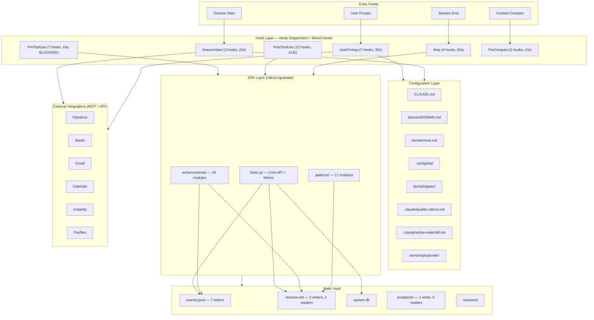
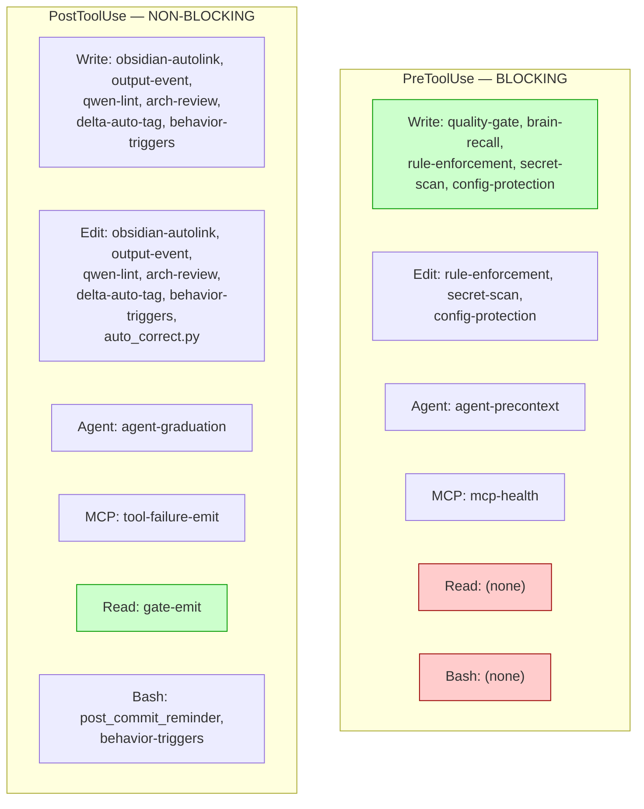
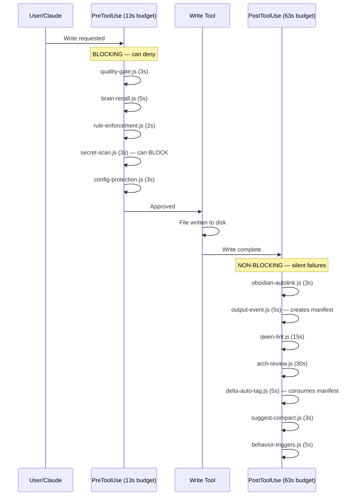
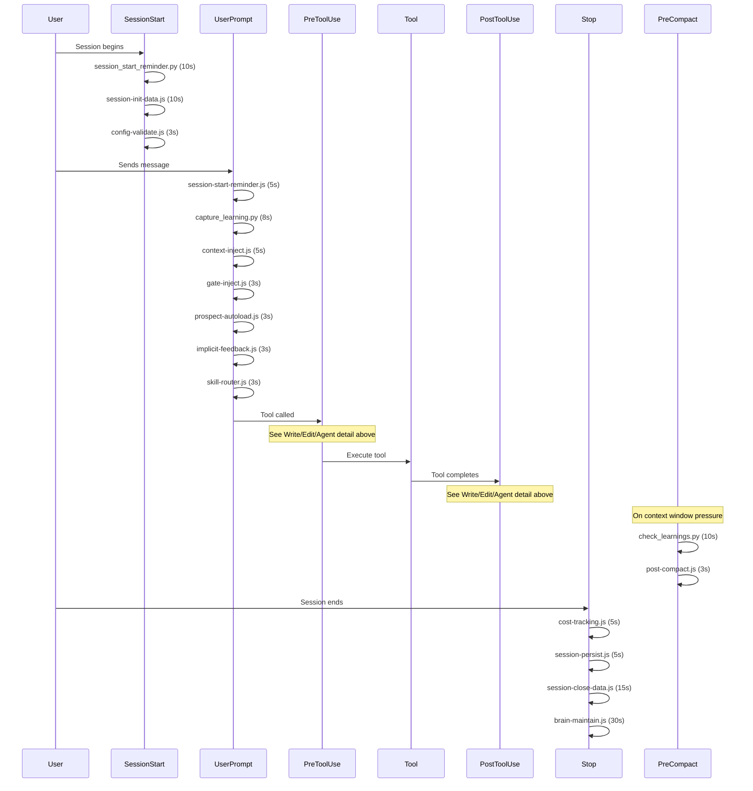
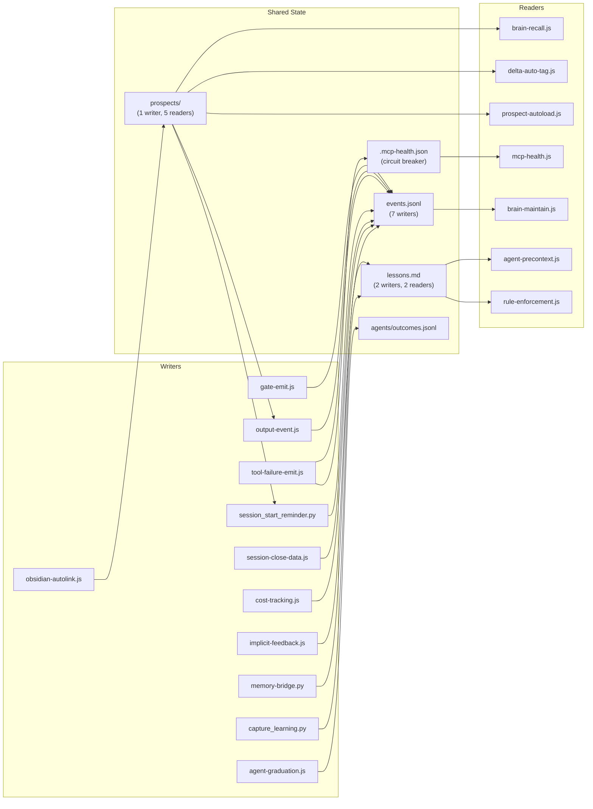
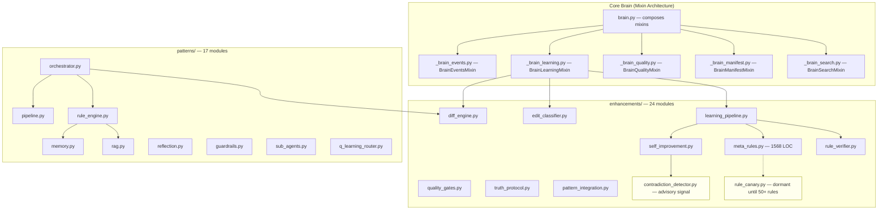
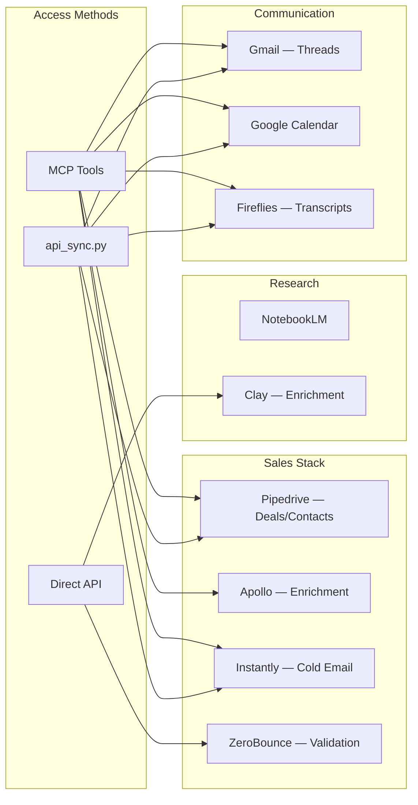

# Gradata System Architecture

## High-Level Overview

## Learning Pipeline Flow

```mermaid
graph LR
    A[User Edits Draft] --> B[auto_correct.py]
    B --> C[edit-distance.py]
    C --> D[edit-classifier.py]
    D --> E[CORRECTION Event]
    E --> F[events.jsonl]

    F --> G[capture-session-corrections.py]
    G --> H["lessons.md — INSTINCT"]

    H --> I{"Confidence threshold met?<br/>Sufficient applications"}
    I -->|Yes| J[PATTERN]
    I -->|No| H

    J --> K{"Higher threshold met?<br/>More applications required"}
    K -->|Yes| L[RULE]
    K -->|No| J

    L --> M{"Related rules cluster?"}
    M -->|Yes| N["META-RULE (Cloud)"]
    M -->|No| L

    N --> O[agent-precontext.js]
    O --> P[Injected into Next Session]

    style A fill:#f9f,stroke:#333
    style N fill:#ff9,stroke:#333
    style P fill:#9f9,stroke:#333
```

## Tool Coverage Matrix

## Hook Execution — Write Operation

## Hook Execution — Full Session Lifecycle

## Data Flow — Shared State

## SDK Module Map

## External Integration Map

