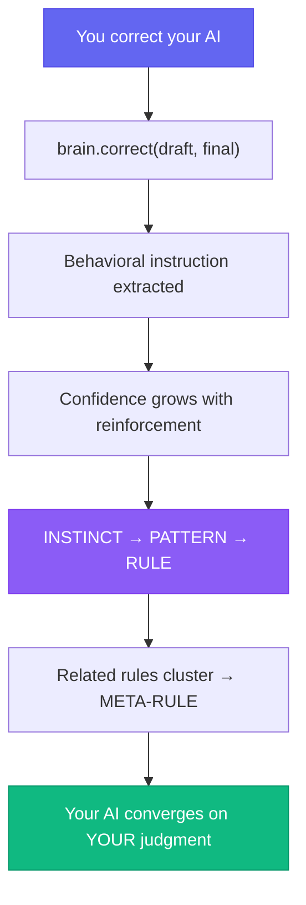
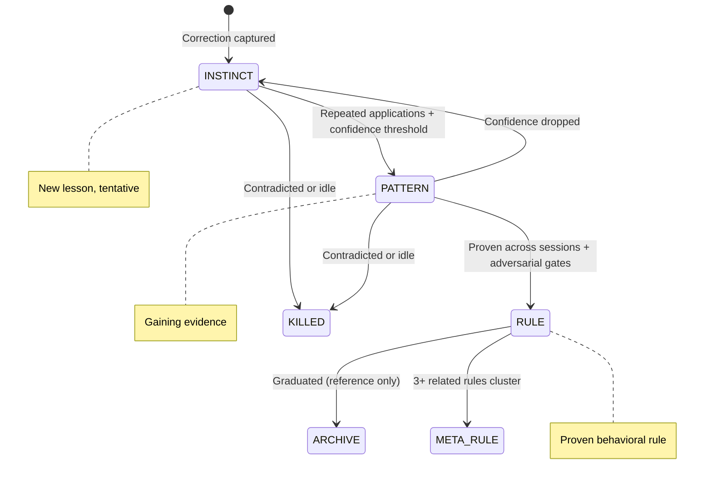
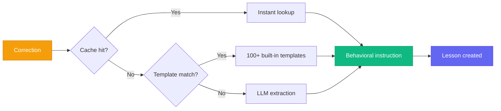
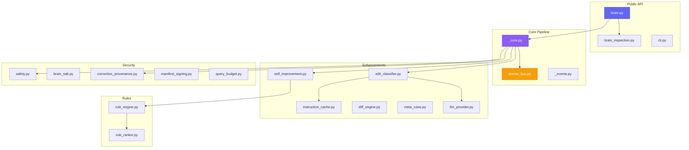

# Gradata

## AI that learns your judgment, not just your preferences.

[](https://github.com/Gradata/gradata/actions/workflows/test.yml)
[](https://pypi.org/project/gradata/)
[](https://pypi.org/project/gradata/)
[](LICENSE)

Install the SDK, use Claude or GPT like you already do, and correct it when it's wrong. Gradata turns your repeat corrections into durable rules the AI carries forward — automatically. Unlike prompt engineering, which asks you to guess what the model needs, Gradata learns from what you actually fix.

- **Local-first.** Your brain stays on your machine. AGPL-3.0 — fork it, host it, change it.
- **Proven.** Simulation-validated learning loop (MiroFish panel methodology + published research on behavioral learning).
- **Measurable.** *Est. Time Saved*, *Mistakes Caught*, *Sessions to Graduate* — honest metrics, not vanity.

Not generally more intelligent. Calibrated to you.

```bash
pip install gradata
```

Or, one-command setup including IDE hooks (Node 18+ required):

```bash
npx gradata-install install --ide=claude-code
```

### JS/TS apps

The `@gradata/cli` npm package emits correction events from Node to a local Gradata daemon, no Python required at call time:

```bash
npm i @gradata/cli
```

```ts
import { GradataClient } from "@gradata/cli";

const client = new GradataClient({ endpoint: "http://127.0.0.1:8765" });
await client.correct({
  draft: "We are pleased to inform you of our new product offering.",
  final: "Hey, check out what we just shipped.",
  outputType: "email",
});
```

See [`packages/npm/README.md`](./packages/npm/README.md) for the full API and CLI wrapper.

### Docker (self-host the daemon)

```bash
docker run --rm -p 8765:8765 -v $(pwd)/brain:/brain \
  ghcr.io/gradata/gradata/daemon:latest \
  daemon --brain-dir /brain --port 8765
```

Or build locally from the repo root: `docker build -t gradata/daemon:dev .`. A `docker-compose.yml` is included for local development.

Works with any LLM. Python 3.11+. Zero required dependencies.

## Repo layout

- `src/gradata/` — the Python SDK (the heart: correction → rules → graduation pipeline)
- `cloud/` — FastAPI backend + dashboard (optional hosted tier)
- `tests/` — SDK tests (pytest)
- `docs/` — mkdocs site sources (published to gradata.ai/docs)
- `marketing/` — gradata.ai marketing site (Next.js)
- `examples/` — SDK usage examples
- `gradata-install/` — npm wrapper for one-command IDE setup
- `.claude-plugin/` + `hooks/` — Claude Code plugin manifest (install with `/plugin install gradata`)
- `brain/` — research scripts (benchmarks, simulations)

## Intellectual lineage

Gradata synthesizes research from Constitutional AI (Anthropic, 2022), Duolingo's half-life regression (Settles & Meeder, ACL 2016), the Copilot RCT efficacy study (Peng et al., 2023), SuperMemo's two-component memory model (Wozniak, 1995), MT-Bench LLM-as-judge (Zheng et al., NeurIPS 2023), and the 15 agentic patterns (orchestrator, reflection, memory, rule_engine, and the rest). It stands alongside Mem0, Letta, and EverMind as an open memory system — with one difference: Gradata learns from your corrections, not just recalls facts. What's new is the graduation pipeline that turns repeated mistakes into durable rules, validated by multi-agent simulation. See [CREDITS.md](./CREDITS.md) for the full list.

## Quick Start

### Claude Code (recommended)

```
/plugin marketplace add Gradata/gradata
/plugin install gradata
```

Requires `pipx install gradata` first (Python 3.11+). See [.claude-plugin/README.md](./.claude-plugin/README.md) for full setup and troubleshooting.

### Python SDK (advanced)

```bash
pipx install gradata
gradata install-hook --ide=claude-code
```

### Library usage

```python
from gradata import Brain

brain = Brain.init("./my-brain")

# Your AI produces output. You fix it. Brain learns.
brain.correct(
    draft="We are pleased to inform you of our new product offering.",
    final="Hey, check out what we just shipped."
)
# Brain extracts: "Write in a casual, direct tone, avoid formal business language"

# Next session, inject learned rules into the prompt:
rules = brain.apply_brain_rules("write an email")
# > "[RULE] TONE: Write in a casual, direct tone..."

# Prove the brain is converging:
manifest = brain.manifest()
```

## How It Works



### The Graduation Pipeline

Every correction creates a lesson that must earn its way into your AI's behavior:



Rules don't just accumulate. They compete. Contradicted rules lose confidence and die. Idle rules decay. Only rules that survive repeated real-world application get promoted. This is evolution, not configuration.

## Why This Works

**Corrections are signal.** Every time you edit an AI's output, you're encoding your expertise. Most systems throw that signal away. Gradata captures it, extracts what you meant, and turns it into a rule.

**Meta-rules compress clusters of graduated rules.** When 3+ rules share structure, an LLM synthesizes a meta-rule with scoped applies_when / never_when tags. Ablation v3: LLM-synthesized meta-rules add value on smaller models and sit neutral on larger ones. Deterministic-template meta-rules regressed and are gated out. Meta-rules are optional and off by default on frontier models.

**Convergence is measurable.** Track corrections-per-session over time. When the curve flattens, the brain has learned your style. That curve is the product demo.

## Ablation Experiment Results

Ablation v4: 4 models (Sonnet 4.6, DeepSeek V3, qwen2.5-coder:14b, gemma3:4b) x 6 conditions x 16 tasks x 3 iterations, 432 trials, judged blind by Haiku 4.5.

| Model | Preference lift (rules vs base) | Correctness (rules vs base) |
|-------|--------------------------------:|----------------------------:|
| Sonnet 4.6     | +2.7% | +0.4% |
| DeepSeek V3    | +5.1% | +0.9% |
| qwen2.5-coder 14B | +5.7% | +3.6% |
| gemma3:4b      | +3.4% | +1.1% |

Preference-adherence lift is the load-bearing claim. Correctness lift is neutral-to-positive on rules alone. Small, local models (qwen14b, gemma3:4b) benefit more than frontier models.

**Min 2022 random-label control.** A known ICL-skeptic challenge: are rules doing real work, or is the XML envelope just giving the model a format hint? We re-ran the rules condition with Sonnet-generated plausible-but-semantically-unrelated rule text in the same envelope. Three of four models regress on preference by 3-10% when content is randomized. Content is doing the work, not format.

The rules don't make the AI generally smarter. They calibrate it to one user's preferences.

## Behavioral Extraction



Old approach (diff fingerprints):
> `"Content change (added: getattr)"`

New approach (behavioral instructions):
> `"Use getattr() for safe attribute access on objects that may lack the attribute"`

Every correction produces an actionable instruction through a three-tier pipeline: cache hit, template match (100+ built-in), or LLM extraction via any provider (Anthropic, OpenAI, Ollama, or any OpenAI-compatible endpoint).

## What Makes This Different

Memory systems remember what you said. Gradata learns how you think.

| System | Remembers | Learns from corrections | Graduates rules | Proves convergence |
|--------|-----------|------------------------|-----------------|-------------------|
| Mem0 | Yes | No | No | No |
| Letta (MemGPT) | Yes | No | No | No |
| LangChain Memory | Yes | No | No | No |
| **Gradata** | Yes | **Yes** | **Yes** | **Yes** |

**vs Mem0:** Mem0 stores context. Gradata evolves behavior. You could use both.

**vs fine-tuning:** Fine-tuning is expensive, slow, and loses the original model. Gradata adapts at inference time.

**vs system prompts:** System prompts are static. Gradata's rules are dynamic, evolving based on your corrections.

## Features

**Core learning loop:**
- `brain.correct(draft, final)` — captures corrections, extracts behavioral instructions
- `brain.apply_brain_rules(task)` — injects graduated rules into prompts
- `brain.manifest()` — mathematical proof the brain is converging
- `brain.prove()` — paired t-test showing correction rate decreased

**Event bus:**
- `brain.bus.on(event, handler)` — subscribe to any pipeline event
- Events: `correction.created`, `lesson.graduated`, `meta_rule.created`, `session.ended`

**Rule inspection + approval:** see [Inspection & Transparency API](#inspection--transparency-api) below.

**Security:**
- PII redaction before storage (credentials, emails, SSNs, credit cards)
- HMAC-SHA256 correction provenance (signed proof of who corrected what)
- Score obfuscation in prompts (no raw confidence values leaked to LLMs)
- Per-brain salt for non-deterministic graduation thresholds

**Integrations:**
- OpenAI, Anthropic, LangChain, CrewAI adapters
- MCP server for Claude Code, Cursor, Windsurf
- Claude Code hooks: `gradata hooks install` — auto-captures corrections
- Custom LLM providers: `GRADATA_LLM_PROVIDER=openai` or any OpenAI-compatible endpoint

## Inspection & Transparency API

Every graduated rule can be traced back to the corrections that created it. No opaque behavior. Git diff for AI preferences.

```python
from gradata import Brain

brain = Brain("./my-brain")

# List graduated rules (optionally filter by category or include all states)
rules = brain.rules()
rules = brain.rules(include_all=True, category="tone")

# Trace a rule to the corrections that created it
brain.explain("rule_abc123")
# → {"rule_id": ..., "description": ..., "source_corrections": [...], "sessions": [...]}

# Full provenance chain (rule → lesson → corrections → events)
brain.trace("rule_abc123")

# Export rules for review, diffing, or sharing
brain.export_data(output_format="json")   # or "yaml"
brain.export_rules(min_state="PATTERN")   # OpenSpace-compatible SKILL.md
brain.export_rules_json(min_state="RULE") # flat sorted JSON array
brain.export_skill(output_dir="./skills") # full skill directory
brain.export_tree(format="obsidian", path="./vault")

# Human veto: review what graduated, keep or demote
brain.pending_promotions()                # rules in PATTERN/RULE state
brain.approve_promotion("rule_abc123")    # endorse (persists reviewed flag)
brain.reject_promotion("rule_abc123")     # demote back to INSTINCT
```

See [docs/sdk/brain.md](./docs/sdk/brain.md#inspection--transparency) for full signatures and return shapes.

## CLI

```bash
gradata init                                    # Create a brain
gradata correct --draft "..." --final "..."     # Log a correction
gradata review                                  # Approve/reject pending lessons
gradata convergence                             # ASCII chart of correction trend
gradata stats                                   # Brain health metrics
gradata manifest --json                         # Quality proof
gradata demo ./eval-brain                       # Try with a pre-trained brain
gradata hooks install                           # Auto-capture from Claude Code
gradata doctor                                  # Diagnose issues
```

## Architecture



## Try It Now

```bash
# Install
pip install gradata

# Try with a pre-trained demo brain
gradata demo ./eval-brain
gradata convergence --brain-dir ./eval-brain

# Or start fresh
gradata init ./my-brain
```

## Community

- [GitHub Issues](https://github.com/Gradata/gradata/issues) — bugs, features, questions
- [GitHub Discussions](https://github.com/Gradata/gradata/discussions) — ideas, show & tell
- [Documentation](https://gradata.github.io/gradata/) — guides, API reference

## Contributing

See [CONTRIBUTING.md](CONTRIBUTING.md).

## License

Gradata is dual-licensed:

- Open source: [AGPL-3.0-or-later](LICENSE)
- Commercial alternative for organizations that cannot use AGPL: see [docs/LICENSING.md](docs/LICENSING.md) — contact hello@gradata.com.
