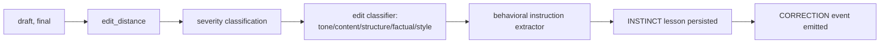

# Corrections

A **correction** is any edit you make to AI-generated output. It is the primary learning signal Gradata uses to build procedural memory.

## What counts as a correction

- You rewrite an email draft before sending.
- You delete a function the AI wrote and write your own.
- You reject a PR suggestion and commit something different.
- You push back in chat: "don't include pricing."

All of these produce a `draft → final` delta that `brain.correct()` can ingest:

```python
brain.correct(
    draft="We are pleased to inform you of our new product offering.",
    final="Hey, check out what we just shipped.",
)
```

Under the hood, `correct()` runs through a small pipeline:



## Explicit vs implicit

**Explicit corrections** come from `brain.correct(draft, final)` or from the `auto_correct` hook (fires on `PostToolUse` for Edit/Write).

**Implicit corrections** come from the `implicit_feedback` hook (strict profile). It scans `UserPromptSubmit` messages for pushback patterns like "don't do that", "stop doing X", or contradictions and routes them through the same pipeline. You can also call it manually:

```python
brain.detect_implicit_feedback("Don't include pricing in emails.")
```

## Severity tiers

Every correction is labelled with one of five severity tiers, computed from edit distance and scaled by category:

| Tier | Meaning | Survival weight | Contradiction weight |
|------|---------|-----------------|----------------------|
| `trivial` | Typo, punctuation, whitespace | 0.30 | 0.80 |
| `minor` | Single word or short phrase swap | 0.60 | 0.90 |
| `moderate` | Sentence-level rewrite | 0.80 | 1.00 (baseline) |
| `major` | Multi-sentence change | 1.00 | 1.65 |
| `rewrite` | Output discarded, full rewrite | 1.20 | 1.80 |

Higher severity moves confidence faster in both directions. A `trivial` correction barely dents confidence; a `rewrite` hits hard.

## Edit-distance math

`diff_engine` computes a normalized Levenshtein edit distance:

```
edit_distance = levenshtein(draft, final) / max(len(draft), len(final))
```

Mapping to severity (approximate):

| Edit distance | Tier |
|---------------|------|
| `0.00 – 0.05` | `trivial` |
| `0.05 – 0.20` | `minor` |
| `0.20 – 0.50` | `moderate` |
| `0.50 – 0.80` | `major` |
| `0.80 – 1.00` | `rewrite` |

Thresholds adjust per category: a typo fix on code weighs differently than a typo fix on prose.

## Classification

Every correction is classified into one or more of:

- **TONE** — voice, register, formality
- **CONTENT** — factual additions or deletions
- **STRUCTURE** — ordering, formatting, hierarchy
- **FACTUAL** — correctness fixes
- **STYLE** — phrasing, idiom, house-style

Classifications drive scoping: a TONE correction won't affect FACTUAL rules in the same session, and vice versa.

## Scoping

Every correction is also tagged with:

- **Task type** — `email_draft`, `code_review`, `research`, `demo_prep`, etc.
- **Audience tier** — `executive`, `technical`, `peer`
- **Domain** — from the brain's config (`Sales`, `Engineering`, ...)
- **Stakes** — derived from risk signals

This prevents rules from leaking across contexts. A correction about email tone won't start enforcing itself on code reviews.

## What the brain stores

Each correction writes:

1. A `CORRECTION` event in `system.db` (append-only, immutable).
2. One or more INSTINCT-tier lessons (confidence ≈ 0.50, or 0.30 for HIGH_ERROR categories).
3. An extracted behavioral instruction (e.g. "Write casually, not formally") if the instruction extractor can identify one.

Nothing graduates yet. Graduation happens in the next step — see [Graduation](graduation.md).

## Inspecting corrections

```python
events = brain.query_events(event_type="CORRECTION", last_n_sessions=5)
for e in events:
    print(e["session"], e["data"]["severity"], e["data"]["classifications"])
```

```bash
gradata diagnose                 # correction patterns report
gradata convergence              # corrections-per-session trend
```
