---
hide:
  - navigation
---

# Gradata

**Learns from corrections. Enforces with hooks.**

Gradata is procedural memory for AI agents. Every time you edit AI output, Gradata captures the correction, graduates it into a rule, and auto-generates a hook that enforces the rule on the next run. Your AI stops making the same mistake. It converges on your judgment.

One brain, many hosts. Open source SDK (AGPL-3.0), optional hosted cloud at [gradata.ai](https://gradata.ai).

---

## 60-second quickstart

### 1. Install

```bash
pip install gradata
```

### 2. Create a brain

```python
from gradata import Brain

brain = Brain.init("./my-brain", domain="Engineering")
```

### 3. Capture your first correction

```python
brain.correct(
    draft="We are pleased to inform you of our new product offering.",
    final="Hey, check out what we just shipped.",
)
```

Gradata extracts the behavioral instruction ("write casually, not formally"), starts tracking confidence, and logs a `CORRECTION` event.

### 4. Watch it graduate

```python
# After 3+ similar corrections the lesson graduates INSTINCT → PATTERN → RULE.
brain.end_session()
rules = brain.apply_brain_rules("write an email")
print(rules)
# <brain-rules>
#   [RULE:0.92] TONE: Write in a casual, direct tone. Avoid formal business prose.
# </brain-rules>
```

### 5. Install the hook

```bash
gradata hooks install --profile standard
```

The rule is now auto-injected into every Claude Code session as a hook. No manual prompt edits, no CLAUDE.md drift. The AI enforces your judgment on the next run.

---

## How it works

```mermaid
flowchart LR
    A[You correct AI output] --> B[brain.correct]
    B --> C[Behavioral instruction extracted]
    C --> D[Confidence grows]
    D --> E[INSTINCT → PATTERN → RULE]
    E --> F[3+ rules cluster → META-RULE]
    F --> G[Hook generated]
    G --> H[AI enforces on next run]
    style A fill:#7c3aed,stroke:#5b21b6,color:#fff
    style E fill:#a78bfa,stroke:#7c3aed,color:#fff
    style G fill:#10b981,stroke:#059669,color:#fff
```



See [Concepts → Graduation](concepts/graduation.md) for the confidence math.

---

## Where to go next

<div class="grid cards" markdown>

- **[Installation](getting-started/install.md)**

    Install the SDK and verify your environment.

- **[Your First Brain](getting-started/first-brain.md)**

    Walk through `Brain()`, `add_rule`, first correction.

- **[Claude Code Setup](getting-started/claude-code.md)**

    Install hooks in `~/.claude/settings.json`.

- **[Concepts](concepts/corrections.md)**

    How corrections, graduation, and meta-rules work.

- **[SDK Reference](sdk/brain.md)**

    The `Brain` class API.

- **[CLI](cli.md)**

    Full `gradata` command reference.

- **[Cloud](cloud/overview.md)**

    Hosted dashboard and operator view.

- **[FAQ](faq.md)**

    Privacy, self-hosting, pricing.

</div>

---

## Why Gradata

**Portable.** Your brain works across Claude Code, Cursor, VS Code, and any MCP host. Switch tools, keep your brain.

**Provable.** Every brain generates a `brain.manifest.json` with real metrics: sessions trained, correction rate, rules active, compound score.

**Shareable.** Export your brain as an archive. Rent it. Sell it. A senior engineer's code review brain, a top AE's email brain — expertise as a product.

**Open.** SDK is AGPL-3.0. No lock-in, no vendor trap. Self-host or use [Gradata Cloud](cloud/overview.md).
