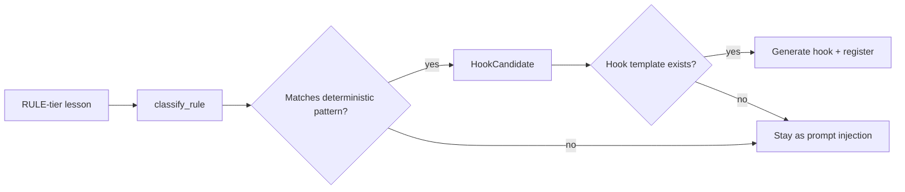

# Rule-to-Hook

Not every rule needs an LLM to enforce it. When a graduated rule is **deterministic** — checkable with a regex, a file stat, or a shell predicate — Gradata promotes it from a prompt-injected rule to a **hook** that runs outside the LLM entirely.

This is the rule-to-hook pipeline. It happens automatically during graduation.

## Why hooks beat prompts

- **Reliability.** An LLM can forget a rule mid-session. A shell hook cannot.
- **Speed.** A `PreToolUse` hook runs in milliseconds. A rule in the prompt costs every turn.
- **Scope.** Hooks can block actions the LLM hasn't requested yet — duplicate file writes, config weakening, secret leaks.

## How promotion works



`gradata.enhancements.rule_to_hook.classify_rule(description, confidence)` runs a set of regex patterns against the rule's description to decide:

| Pattern matched | Determinism | Hook template |
|-----------------|-------------|---------------|
| "never use em dash" | `REGEX_PATTERN` | `regex_replace` |
| "keep files under N lines" | `FILE_CHECK` | `file_size_check` |
| "never commit secrets" | `COMMAND_BLOCK` | `secret_scan` |
| "run tests after" | `TEST_TRIGGER` | `auto_test` |
| "always read before editing" | `FILE_CHECK` | `read_before_edit` |
| "never rm -rf" | `COMMAND_BLOCK` | `destructive_block` |
| "never force-push" | `COMMAND_BLOCK` | `destructive_block` |

Rules that don't match any deterministic pattern stay as prompt injections.

## EnforcementType

```python
from gradata.enhancements.rule_to_hook import EnforcementType

EnforcementType.PROMPT_INJECTION    # Default: injected into LLM context
EnforcementType.HOOK                # Claude Code hook (shell command)
EnforcementType.MIDDLEWARE          # API wrapper (Python function)
EnforcementType.GUARDRAIL           # LangChain / CrewAI guard
```

A rule can have multiple enforcement paths at once: injected into the prompt *and* enforced by a hook. Belt and suspenders.

## Cross-platform export

Graduated rules can be exported to whatever format your agent host expects. `brain.export_rules()` and `gradata.enhancements.reporting.export_briefing()` both produce per-host files.

Built-in export targets:

| Host | File | Format |
|------|------|--------|
| Claude Code | `BRAIN-RULES.md` | Markdown with `MUST` / `SHOULD` / `MAY` priorities |
| Cursor | `.cursorrules` | Plain text rules |
| Copilot | `.github/copilot-instructions.md` | Markdown |
| Generic | `brain-briefing.md` | Markdown (any tool) |

Exporting:

```python
from gradata import Brain
from gradata.enhancements.reporting import export_briefing

brain = Brain("./my-brain")

# All hosts at once
export_briefing(brain, formats=["claude", "cursor", "copilot", "generic"])

# Just one
export_briefing(brain, formats=["cursor"])
```

From the CLI:

```bash
gradata report --type rules
```

### Custom targets

The export map is open:

```python
from gradata.enhancements.reporting import EXPORT_TARGETS

EXPORT_TARGETS["cline"] = ".clinerules"
EXPORT_TARGETS["continue"] = ".continue/rules.md"
EXPORT_TARGETS["codex"] = ".codex/AGENTS.md"
```

Any key you add becomes a valid `formats=[...]` argument.

## Priority mapping

When rules are exported to a prompt format, the lesson state maps to a priority token:

| Lesson state | Priority | Typical rendering |
|--------------|----------|-------------------|
| `RULE` | `MUST` | Required. Violating is a hard fail. |
| `PATTERN` | `SHOULD` | Strong preference. Violating needs justification. |
| `INSTINCT` | `MAY` | Advisory only. Not exported unless `--include-instincts`. |

The adapters in `gradata.integrations.*` read these priority markers when they build the system prompt.

## Example: regex rule → hook

Source rule:

```
[RULE:0.93] DRAFTING: Never use em dashes in emails.
```

`classify_rule()` returns:

```python
HookCandidate(
    rule_description="Never use em dashes in emails.",
    rule_confidence=0.93,
    determinism=DeterminismCheck.REGEX_PATTERN,
    enforcement=EnforcementType.HOOK,
    hook_template="regex_replace",
    reason="Matches deterministic pattern: never use em.?dash",
)
```

The `regex_replace` template then generates a `PostToolUse` hook that scans Write/Edit content for `—` and rewrites to `:`, `,`, or a split sentence. Zero LLM calls.

## Manual promotion

If you want to promote a rule to a hook directly:

```python
from gradata.enhancements.rule_to_hook import classify_rule, EnforcementType

candidate = classify_rule("Never use em dashes in emails", confidence=0.9)
if candidate.enforcement == EnforcementType.HOOK:
    print(f"Can promote using template: {candidate.hook_template}")
```

And to install the generated hook into `~/.claude/settings.json`:

```bash
gradata hooks install --profile standard
```

See [Claude Code Setup](../getting-started/claude-code.md) for the full hook registry.
